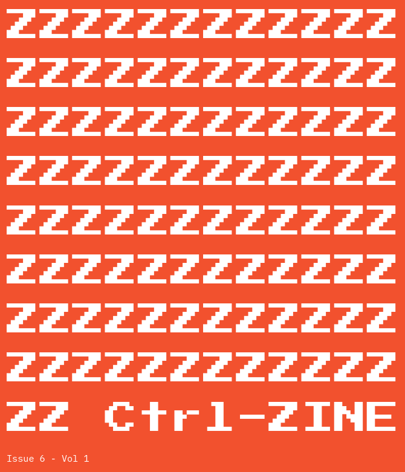
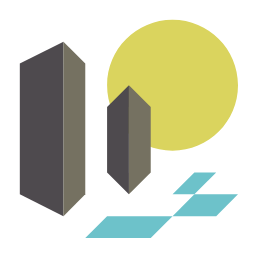
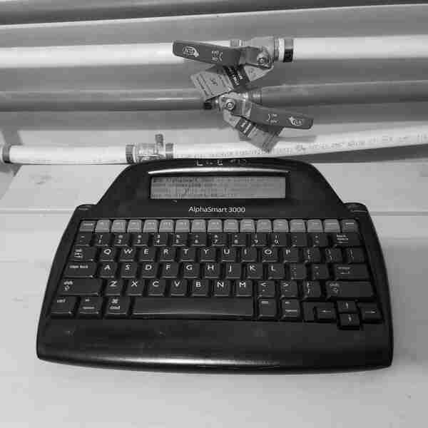
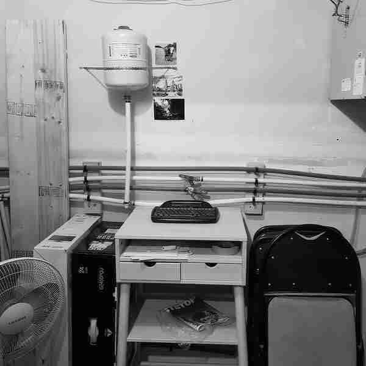

\
\

\thispagestyle{empty}\clearpage

\begingroup \smallfont \setcounter{page}{1}

**About ^Z**

Ctrl-ZINE (^Z) is a Ctrl-c.club/Smol Web collaborative zine that celebrates
tech and the Smol Web. Started in March 2023, it runs a monthly issue, where
anyone can download a PDF version and a pre-folded PDF version for home
printing. No digital format of the content is maintained on a Website
whatsoever. Some of the topics within these issues range from Smol Web
protocols and communities (ActivityPub, Tildeverse), Web-adjacent protocols
(Gopher, Gemini), alternative forms of communication (HAM radio, IRC),
snippets of code, artwork, and anything tech-related that is an expression of
self.

Those who contribute to ^Z are passionate about what they share. They want
what is best for Us, the citizens of the Web. With that, anyone with that same
passion is welcome and encouraged to contribute to future issues. Further info
can be found in the Editorial section of this issue. May the Smol Web live
forever!

---

**Editorial**

| Ctrl-ZINE
| Licensed under ShareAlike 4.0 International License
| 
| ZINEHEAD Press
| e-mail: <zinehead@fastmail.com>

**Contributors**

| ~wbknl \hspace{1.5in} ~nttp (Felix Pleşoianu)
|
| ~pgadey \hspace{1.5in} ~luchiz
|
| ~singletona82

| **Originally put together by ~loghead**
| **Re-Compiled by ~basilmori as a proof of concept**

\clibyte{CLI BYTE: “Whois” - client for the whois directory service}

\endgroup

# Intro

\begingroup \largefont

Has it been a whole month? It seems like just yesterday
Issue 5 was released and people were reacting to it
(and hopefully loving it!). But here we are, a month
later, and Issue 6 is ready for reading and absorbing
and sharing and enjoying! I still enjoy compiling every
issue, making the covers, being creative with it, and I
hope others enjoy the end results just as much. Most of
what is here is the work of others - this intro, the
outro, the covers, those are usually me (~loghead) -
and all readers of the zine are welcome to send in
potential artwork, and it shall be considered for an
issue of “the zine” :)

The ^C community has meant so much to me since joining
in March (May?) of 2023, and it continues to be the
strongest, most sincere source of socializing and
sharing online (and there isn’t even a “Like” button!
Whaaaa??). The members and passers though on IRC (the
IRC room is open to anyone, not just ^C members) have
always been a source of motivation and encouragement to
me, to those who visit and participate, and if one
wants to learn things about Linux, Sysadmin, or just
the field of Computer Science in general, ^C is an
excellent resource!

On with Issue 6! May the Internet surfing waves run
high, and the WiFi speeds be limitless!

Live long, the Smol Web!
\endgroup

# INDEX:
1) **W3bK3rN3l radio outpost** *by ~wbknl*

2) **Fun with text user interfaces** *by Felix Pleşoianu*

3) **Artwork** *by ~nttp*

4) **Writing On The AlphaSmart 3000** *by ~pgadey*

5) **Pixelbuild** *by ~luchiz*

6) **HTML Vs Gemini & My Workflow** *by ~Singletona82*


# W3bK3rN3l radio outpost

| wbknl-000001
| \-----------------------
| KG-84 encrypted MIL-STD 188-110B 
| Message made on an ISB circuit
| --> Croughton (AJE)
| --> Sigonella (NSY)

{\
Several theorists suggest that this is a secret communication
station for a secret society, agency, or government, to be used
to communicate in an unbreakable, bizarre cipher. Several major
events and military exercises that have taken place during
intercepts of w3bk3rn3l's radio transmissions back the theory\
}

1....<|.|>.......19..............35........|*...$!........%"..:wq

==> BEGIN ENCRYPTION

\> BOT

I've been isolated in this communications outpost. I no longer
remember when I left Earth, heading to the SOL system and to my
new address called Lagrange L73. All my messages are encrypted,
using an obsolete cryptographic technology designated as KG-84.

The KG-84 is an electronic encryption device used to ensure the
secure transmission of digital data over a variety of networks
such as landlines, satellites, microwave links and Telex lines.
Although most KG-84 military units have been replaced by
equipment such as the KIV-7, or have been replaced by modern
IP-Crypto equipment, I still managed, before leaving Earth, to
bring a unit that was used in my special operations platoon, the
WBKNL.

I send this first message in the hope that it will be read by my
comrades, so that we can communicate in this SOL system, so far
away and so desolate.

[\#\$\%\&\"\/\&\&\"\%\!\$\$ --> noise]

\> EOT

==> END OF ENCRYPTION


\clibyte{CLI BYTE: “kill” - terminate a process}


# Fun with text user interfaces
*By Felix Pleşoianu*

With one week to go, I have one more blog post in my budget for
this year. Might as well make it something fun.

Text user interfaces always have a place even with today's
advanced computers. They're fast, accessible, and can run over a
network without ever being aware of it; a rare example of
transparency. And there are several different ways to make one,
at least in Linux.

Now if your language of choice has access to the curses API, or
another terminal control library, guess you're all set. But it's
often just not an option in your target environment. What to do
then?

The venerable Dialog utility (based on ncurses, and maintained
by the same person for the past couple of decades) is one
option: a small program that can handle a variety of common
interactions like choosing a file to open, or entering dates,
while looking good and being easy enough to use. It's also easy
to call from Python thanks to a popular wrapper library, but
also from Tcl or shell script for example. Just make sure it's
installed where you need it.

Kind of opposite from Dialog sits tput, that always comes with
(n)curses, though usually in a separate package with various
names. This is a low-level alternative, for when you just want
to move the cursor here and there and show colorful text all
over the screen. It also needs to run once per operation, and
that adds up quickly. To fix that we must dig even deeper.
Beware of Balrog.

Yes, I'm talking about sending ANSI escape codes directly to the
terminal. It's simple enough for the most common operations; see
the tutorial on the Bash Hackers Wiki for example (which also
teaches tput), and there are many others. Also it works right
away from any programming language, since you're literally just
printing out text.

On the minus side, it's less portable, because even terminal
emulators have various quirks. But in general it should be
reliable enough. Not so much for something as basic as
navigating a menu with the arrow keys, as opposed to typing in
an option number then Enter. Surprisingly, that requires messy
and even less portable code. In shell script it can be done with
read -n, or similar, but the syntax and semantics differ from
shell to shell. There is no right decision.

Which is my whole point here. What I'm going to choose for my
next project depends on many factors. Dialog was famously
employed in the Slackware-style installer that Debian also used
for a while, so it's pretty damn capable. But it can also be
clumsy, and if it just doesn't fit the flow of your script,
you'll need an alternative. ANSI escape codes underlie terminal
support in the standard libraries of many languages that would
rather not depend on curses for various reasons. And tput might
be worth using simply for the convenience factor.

Variety is good for the soul. It's also good for the health of
an ecosystem, but mostly it's just plain fun to play with
different things and see what looks best in your code. Remember
when coding used to be fun, just a Basic interpreter between you
and the metal?

Next time I'm going to look at the Dialog alternatives for X11.
In the mean time, happy holidays, whatever you're celebrating,
and stay safe.


# Artwork from ~nttp

{ height=30% }\
{ height=30% }\
{ height=30% }


# Writing On The AlphaSmart 3000
*by ~pgadey*



The AlphaSmart 3000 is a single purpose word processing computer
from the early 2000s. In this note, I'll describe how I use my
AlphaSmart to write code effectively, and how I use my headless
server to upload content from the AlphaSmart to ctrl-c.club.

tl;dr: The AlphaSmart 3000 is neat.

If you like retro hardware and writing, then they're well worth
the ~50$CAD it costs to buy one off eBay. They're suprisingly
versatile and lots of fun.

The AlphaSmart 3000 has a four row dot matrix LCD display and
200kb of memory spread across eight files. It takes three AA
batteries, which I'm told last about four hundred hours to a
charge. (I've never had to replace them in the three years that
I've used my AlphaSmart.) The way that that the AlphaSmart
communicates with a computer is by emulating a USB keyboard.
One plugs in the AlphaSmart, hits a Send button, and it manually
"types" the contents of a file in to the computer as though it
were a keyboard. This functionality lends itself to a nice hack
that I'll describe below.

## Writing Effectively

There are three hacks that I've found helpful on the AlphaSmart:
keeping a table of contents, copying common code blocks,
and manually generating raw TTY input. The AlphaSmart has eight
"files" for storing text. One can copy and paste between the
files freely. The search functionality searches all the files in
numerical order.

I noticed that when I use the AlphaSmart after a long pause,
I tend to forget which files had which projects or content in
them. This led me to keep a "Table of Contents" in the first
file. Whenever I turn on the AlphaSmart, I switch to File 1 and
look at where everything is.

File 1 is also the first file to get searched when looking for
text. This means that I keep all my re-usable code snippets in
there. I tend to write a lot of lecture notes using LaTeX for my
work.

This requires lots of repetitive code blocks to make frames.

```latex
%% QFRAME %%
\begin{frame}{TITLE} % (fold)
    \begin{question}
        QUESTION
    \end{question}
    \vspace{\stretch{100}}
    %<*solutions>
        \fbox{\parbox{\textwidth}{
            SOLUTION
        }}
    %</solutions>
\end{frame} % (end)
```

I store these snippets of code in File 1, and access them using
the search function. If I need to add a "question frame" to my
lecture notes, I can search for QFRAME and pull up the required
code in a few seconds. Some other things that I store in File 1
include: headers for my Hugo site, and a bit of raw TTY input to
upload the contents of a file to ctrl-c.club.

## Transferring Content to ctrl-c.club

It is nice to write offline on the AlphaSmart 3000, but we have
all come to expect our devices to have the ability to upload
written material to the cloud. I usually write on the AlphaSmart
in the basement, which happens to have a headless server in it.
One day, it occurred to me that I could use the headless server
to upload material from the AlphaSmart to ctrl-c.club.

## Setup the Headless Computer to Start without An X Server

This is the setup that I used on Ubuntu to make my headless
server boot to login prompt. Edit `/etc/default/grub` with your
favourite editor, e.g. `nano`:

```bash
sudo nano /etc/default/grub
```
Find this line:

```bash
GRUB_CMDLINE_LINUX_DEFAULT="quiet splash"
```
Change it to:

```bash
GRUB_CMDLINE_LINUX_DEFAULT="text"
```
Update GRUB:

```bash
sudo update-grub
```

## Send The Text to the Headless Computer

In File 1, I have the following bunch of raw TTY input.\
It creates a file, opens it in `ed`, and dumps a bunch of raw
text, writes the file, quits, and uploads it to ctrl-c.club.
The LOCAL-USERNAME is my username on my headless server, and
USERNAME is my username on ctrl-c.club.\
(In my case, these happen to be identical.)

```bash
LOCAL-USERNAME
LOCAL-PASSWORD
ALPHASMART="alphasmart-$(date --iso=second).txt"
touch ~/$ALPHASMART
ed ~/$ALPHASMART
a
This is some text from the AlphaSmart
You can include all sorts of stuff here.
Except, of course, a line containing a single period.
.
w
q
<CR>
<CR>
```
```bash
scp $ALPHASMART ctrl-c.club:/home/USERNAME/
exit
<CR>
```

One could really go nuts with this idea. I've thought of adding
bells and whistles to notify me that everything was a success.
If you play with these hacks, or even if you don't, please let
me know!\
Thanks for reading.

~pgadey

\bcenter {height=65%} \ecenter


# Pixelbuild
*by ~luchiz*

Close your eyes.

Imagine that you could build your own multiplayer RPG games,
easily, and with little effort. Imagine how much power you could
gain, from making a community of players from all around the
world, and having them at your very fingertips.

Now open them. It's all there; you just have to use it.

Pixelbuild is a package of tools designed to make your next big
hit. With the Pixelbuild Editor, you can arrange your world with
tiles to match your likings. With basic Python scripting, or any
other programming language of choice, you can give a soul to
your works: giving them commands to follow your orders is
essential to building game mechanics.

Pixelbuild also supports converting RPG Maker games, so you
would never have to worry about porting games to the new
platform.

Pixelbuild is made up of four components: the client, the
server, the engine and the editor. The client is where your
players will play your next game, right from their own homes.
Their computers connect to the server, which is responsible for
handling player movement, game me- chanics and stats. The engine
is where the client displays all the details from the game to
the screen. It can be detached, repurposed and repackaged to
work with standalone games. The editor is where you can edit all
the games you are making. It features a simple-to-use user
interface and powerful utilities made to guide you to your next
project.

With all of them combined, Pixelbuild forms all the utilities
you need for making your next game.


# HTML Vs Gemini & My Workflow
*by Singletona082*

## Who is this for?
I can't be the only one that wanted to make a webpage by hand,
but also looked at the old constraints imposed by the likes of
Angelfire and Geocities as something of a personal challenge
rather than a thing to feel chained down by. Fortunately, both
because our benevolent overlord included an on-Tilde Gemini
server and because web proxies exist in case one wants to share
Gemini material with friends who don't want to grab a browser,
we have a way of maximizing that self-imposed ten megabytes of
space.

## What this is not.
This is not a step-by-step tutorial. I am not going to make
recommendations for web proxies or demand anyone else do things
like I do. This is mostly because my own output is fairly spotty
and regularity is what one should aim for in content creation of
whatever form. Also, and probably importantly, any automation I
might employ would be you to the server, rather than demand the
server perform tasks on its own and thus take up resources. Yes,
Gemini is a tiny TINY protocol, and serving static web pages is
very non-taxing. However, and this is more out of courtesy than
any real knowledge or care of the server's limits, 'you' are one
person amongst many using what is effectively something
someone's had going as a hobby. No need to be rude and hog
resources.

Then again that mindset is from an era a quarter century past. I
doubt even with all of us going tinkermonkey we could make the
server do anything more than tick up a tiny bit. Still, I prefer
to operate under the idea of 'take only what you can get by on rather than
assume you can grab everything you want.'

## Verses?
OK, so the title is a bit clickbait. That said, I shouldn't make
assumptions about the readers. Ergo, explanations are in order.

## HTML:
Everyone here knows what a web page is. Due both to wanting to
do everything by hand and to stick to something resembling the
late 90's 'feel' of things? I've decided to stick with CSS that
basically is me taking the main Ctrl-C site CSS and making a few
very minor tweaks to suit aesthetics, which boils down to a
couple of color tweaks as pure #000000 black isn't actually the
best background in my experience. It may be better for some and
worse for others though so Your Mileage May Vary.

Anyway. I have a few HTML pages that will be big 'Here is Me On
The Web' type largely static things. Most of my content is text
anyway, so having to spin up a ton of HTML pages is, in my mind,
wasteful when another solution exists.

## Gemini:
A protocol made by Solderpunk and is, as far as I'm aware,
considered 'complete' much to the annoyance of the community
that helped hack it together, since now that it's largely done
there isn't anything to tinker with on the back end with the
protocol itself. It is very much of the mantra of 'One Request
by The Client. One Response from The Server.' Some clients like
Lagrange will automate things like auto fetch and expand image
links, but baked into the protocol itself is this idea that 'the
server isn't going to just completely dump a lot of stuff on you
nor will it do anything if 'you' the client don't explicitly ask
it to.'

This makes it terrible for a lot of things as there are no
provisions for streaming content, security past the initial TLS
layer, and there are no inbuilt password or login systems beyond
certs that might or might not expire and most certainly is (in
my experience,) a pain in the meatspace to have on more than one
device. These weaknesses really don't affect my use-case,
though, and Gemini as a 'works alongside' protocol complements
HTML well for my needs.


## Gemini: He Who Walks Beside
If you do lot of text, like me, and want to keep both server
space and bandwidth use low Gemini is honestly far better than
HTML, but perhaps not nearly as light as one might think. Fine,
it's all very basic markdown files, but there's also the TLS
encryption that 'bloats' everything when compared to something
like Gopher. I could have used Gopher, it is a very mature
protocol that was actually created with terminal use in mind
(and as i have learned, terminals don't auto-wrap text on their
own.) I simply have never felt right about how Gopher pages are
created. No real malice or 'snobbery.' Just 'This has never
agreed with me.'

Anyway, it's quite simple:
Have HTML pages as anchor points for wider distribution, and
Gemini pages to house a majority of the content that is either
accessible with dedicated browsers, plugins, or proxies. That's,
quite literally, it. No magic sauce other than the fact I'd
managed to shove several novels worth of fiction plus two years
of blogging, plus a few other things, into a couple of megabytes
of space, where four pages of HTML, a CSS file, and a few images
take twice that space.

I suppose it's cheating to include the images in one and not the
other, but this is where HTML shines well and above Gemini. I
can dictate how those images are presented vs relying on the
client to figure out what to do with things. Mind you I adore
Gemini for leaving everything to the client for style. That is
what makes it supremely suited for accessibility as the protocol 
doesn't care how the client renders; be it braille, audio, or 
whatever so long as it is rendered.

## So, that's it?
Pretty much, but not quite! HTML pages with Gemini links to pad
things out. Both are updated through an SFTP client from my
computer to the server. Just make sure you have both home
directories on your local machine in a folder together so you
can just hit a button and everything updates all at the same
time with minimal hassle.

Where things get interesting is that simple 'here shove updates
to the server via SFTP client' can allow 'you' to automate
things, such as having a weather report page, or a Twitter-esque
microblogging page, or any of a number of things and so long as
you keep your update times reasonable rather than spam the
server with several hundred requests per minute and it should be
OK to add in something like automated reports from a local
weather station, or something that is an analog
to ye olde internet coffee pot camera of old. Keep it to
updating a specific image instead of streaming video to the
server for storage and again it shouldn't be too taxing.

## Next Steps.
For me? My next steps are finding a way to automatically
translate my latest Gemini site updates to HTML so that, for
example, the latest blog entries can be directly read without a
proxy, or have the latest chapter of what I'm working on
readable.

I'm just fumbling about, but given I was there in the 90's this
scratches a very old itch I've had and I thoroughly enjoy that
I'm doing it all by hand rather than a lot of auto-generatedcontent.
So if I do manage to automate a few things I probably won't go much past
automatic transcription of Gemini to HTML for 'latest entries' that get 
replaced when they're updated. If you have other ideas on how to combine the
two protocols, I'd be interested to hear about it, and I'm pretty 
sure I'm not the only one.

\begingroup \largefont

# Outro

And there we have Issue 6 of ^Z, everyone! :) It was a
treat to compile, it was fun to read the new entries as
they came in, and I hope everyone enjoys the content
throughout! :D

This was a fun one to put together, and another long
one, and a lot of formatting had to be just right (as
with all issues), and I can only cross my fingers to
hope that it saves/prints well as a PDF.

So until September, when Issue 7 hits the Web, I will
bid you all adieu, and hope to see everyone in Ctrl-c
IRC chat or/and Iris message forums  or/and e-mail, or
however one wants to get in touch - either to me, a
contributor to the zine (any issue!), or just a nice,
friendly Netizen on ^C - we don’t bite! ;)

Thank you all again for reading. Thank you for
contributing. Thank you for being awesome. And thank
you for being you!

Until later..

~loghead

\endgroup

\vfill\bcenter

\ecenter
